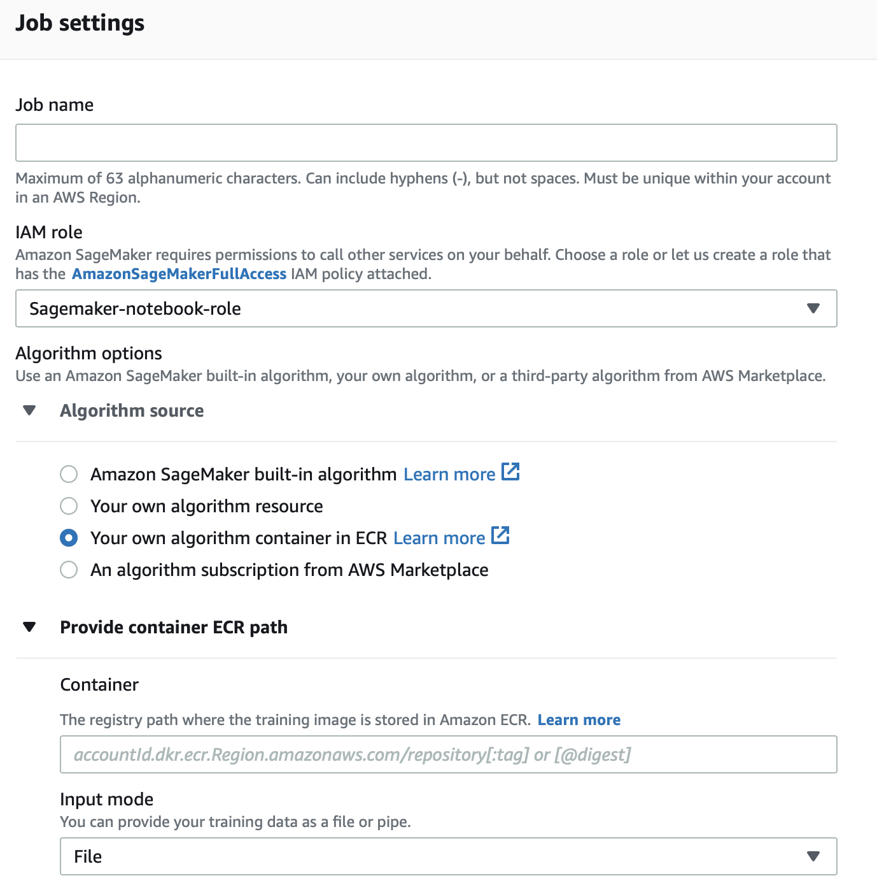

## **SageMaker Training Documentation**

***This documentation assumes you have a working training script.

Creating a SageMaker training job has 4 requirements:
- Container path in ECR (this contains your training program)
- Input (training data) path in S3
- Output (model) path in S3
- Optional: Checkpoint output path in S3

**In order to create a container in ECR, you must download Docker (See [here](https://www.docker.com/get-started)).**

---

### **Training script changes needed**

Implementing an ArgumentParser object is highly recommended to control both the model parameters as well as the environment parameters utilized by a SageMaker training job.

**Above the commented line**

Model parameter inputs. SageMaker has a model optimization routine that could be useful, and in order to use it these parameters must be available on the command line.

**Below the commented line**

**REQUIRED**: Must add 'train' as an argument. SageMaker initializes all training images using `Docker run image train`, therefor train will be the first argument passed into the training script (See [here](https://docs.aws.amazon.com/sagemaker/latest/dg/your-algorithms-training-algo-dockerfile.html)).

The rest of the arguments are environment variables specified in your Dockerfile that align with SageMaker specifications (See [here](https://github.com/aws/sagemaker-training-toolkit/blob/master/ENVIRONMENT_VARIABLES.md)). Defaults are `os.environ['KEY']` calls.

---

### **Dockerfile Info** ([Basic info on Docker](https://vsupalov.com/6-docker-basics/))

**Dockerfile must be named `Dockerfile`  (without an extension) in order to be recognized correctly by Docker in the command line.**

**Important lines**
- Line 1: I am building on top of a pre-built image provided by amazon SageMaker. See [here](https://github.com/aws/deep-learning-containers/blob/master/available_images.md) for more information about which general framework containers are available, and how to pull an image from their public repo (More info below). *Here, I am using the python 3.7 Tensorflow framework that is GPU enabled.*
- Line 7: SAGEMAKER_SUBMIT_DIECTORY is a required environment argument by SageMaker, directing it to the place where the executable script lies. See [extend a prebuilt container](https://docs.aws.amazon.com/sagemaker/latest/dg/prebuilt-containers-extend.html) example.
- Line 9: SM_MODEL_DIR is one of the listed environment variables from [earlier](https://github.com/aws/sagemaker-training-toolkit/blob/master/ENVIRONMENT_VARIABLES.md) that should provide your script the location outputs should be saved to. This should always be '/opt/ml/output', as SageMaker mounts your specified S3 bucket to this exact location within the container. More info [here](https://docs.aws.amazon.com/sagemaker/latest/dg/your-algorithms-training-algo-output.html), along with further instruction on line 11.
- Line 15: SAGEMAKER_PROGRAM is also a required argument by SageMaker (similar to line 7) that specifies the training script within the submitted directory.
- Line 17: SageMaker requires the exec format of an ENTRYPOINT command for program initialization.

**Pulling a prebuilt docker image to build on**

The docker images given [here](https://github.com/aws/deep-learning-containers/blob/master/available_images.md) (same link as line one) are built and maintained by amazon for use alongside SageMaker abnd other services. They come fully equipped with the Framework of your choice (TensorFlow, PyTorch, MXNet). After signing into the AWS CLI and downloading docker, copy and paste this command into your terminal (if you arent signed in to us-east-1, just change those portions to your region):

`ws ecr get-login-password --region us-east-1 | docker login --username AWS --password-stdin 763104351884.dkr.ecr.us-east-1.amazonaws.com`

Then, pull your container using:

`docker pull <name of container image>`

The container image name is simply the entire example url. For example, the tensorflow 2.4.1 training GPU py37 option I used in us-east-1 would be:

 `docker pull 763104351884.dkr.ecr.us-east-1.amazonaws.com/tensorflow-training:2.4.1-gpu-py37-cu110-ubuntu18.04`

---

### **Push your container image**
After you have finished editing your training script and completed your Dockerfile, we need to push our container image to Elastic Container Registry (ECR). The easiest steps to do so are as follows:
1. Create a [new repo](https://docs.aws.amazon.com/AmazonECR/latest/userguide/repository-create.html) in ECR for your container image
2. Create a terminal instance at your project directory (with the Dockerfile in it)
3. Sign into your AWS session using the [AWS command line interface (CLI)](https://aws.amazon.com/cli/) in terminal
4. In your repositories page, look for 'VIEW PUSH COMMANDS' in the top right, and copy and paste those commands successively into your terminal.

Note: The first push to ECR will likely require data upload in the gigabytes.

---

### **Creating a training job**
With your container image pushed to ECR, we should be ready to go to create a training job. Navigate to Amazon SageMaker in the management console, and go to training jobs -> create training job.

**IMPORTANT**: The ECR repo, training data, and training instance must be located in the same region within AWS.

After specifying a name, use IAM Role 'Sagemaker-notebook-role' to allow the instance access to S3.
Under algorithm source, choose 'Your own algorithm container in ECR'. Then paste your latest container image URI under 'Container' (Find your container's URI by navigating to your ECR Repo you just pushed to).

Under resource configuration, choose your desired instance type and count. See [Available SageMaker Studio Instance Types](https://docs.aws.amazon.com/sagemaker/latest/dg/notebooks-available-instance-types.html).
*Note: For Sofia training, preliminary testing shows ml.g4dn.4xlarge is most efficient (this is a GPU enabled instance)*

There is one crucial step under input data configuration. On line 11 of the Dockerfile, we specified /opt/ml/input/data/**training** as our training input. Here, that is related to the 'Channel name' shown above.

Each channel added here gets its own directory within the container after initialization, with path '/opt/ml/input/data/**{channel_name}**'. This makes it easy to add validation, testing, or other inputs if needed.

Under S3 location, add the relative path to the input data you want for that specific channel (dont add the absolute path, SageMaker just copies everything from the folder you specify)

Finally, below input data configuration, specify S3 buckets for checkpoint and output files from the training instance for the model and other outputs to be saved. Then, begin training.
